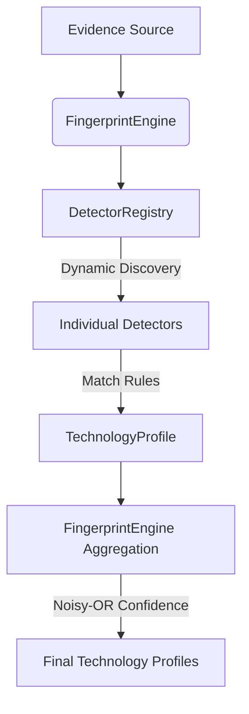

# Architecture Hardening Documentation

This document describes the pluggable, decoupled architecture of the Cadresec intelligence engine, refactored in Phase 1.5.

## Architecture Overview

The detection engine has been modularized to decouple individual technology signatures from the core orchestration logic. It follows the registry pattern:



---

## Evidence Flow

1. **Generation**: Passive or active tools (e.g. `HTTPProbe`, `DNSLookup`, `BannerGrab`) query targets and generate structured [Evidence](file:///c:/Users/mujum/OneDrive/Desktop/Cadresec/cadresec/intelligence/evidence.py) objects.
2. **Typing**: Evidence uses the strongly typed `EvidenceType` enum instead of arbitrary strings.
3. **Tracking**: Observation timestamps are stored as timezone-aware Python `datetime` objects.

---

## Technology Detection Flow

1. The [FingerprintEngine](file:///c:/Users/mujum/OneDrive/Desktop/Cadresec/cadresec/intelligence/engine.py) initializes and calls `DetectorRegistry.load_detectors()`.
2. The registry dynamically scans the `detectors/` folder, importing subclasses of `BaseDetector`.
3. For each piece of evidence, every detector is invoked.
4. If a detector matches, it returns a [TechnologyProfile](file:///c:/Users/mujum/OneDrive/Desktop/Cadresec/cadresec/intelligence/models.py) representing the individual match.
5. The engine aggregates all matches per technology name.
6. **Noisy-OR Confidence Aggregation**:
   Multiple matching sources of evidence mathematically increase the confidence score:
   $$C_{\text{combined}} = 1.0 - \prod_{i} (1.0 - p_i)$$

---

## Detector Architecture

Every detector inherits from the [BaseDetector](file:///c:/Users/mujum/OneDrive/Desktop/Cadresec/cadresec/intelligence/detectors/base.py) class. Standard detectors only need to specify their metadata and matching rules:

```python
from cadresec.intelligence.detectors.base import BaseDetector
from cadresec.intelligence.enums import TechnologyCategory, EvidenceType

class MyDetector(BaseDetector):
    name = "MyTech"
    category = TechnologyCategory.SERVER
    rules = [
        # (EvidenceType, Regex Pattern, Confidence, Version Regex/None)
        (EvidenceType.HEADER, r"(?i)mytech-version/([\d\.]+)", 0.95, None)
    ]
```

---

## Folder Structure

```
cadresec/
    intelligence/
        __init__.py             # Public interfaces
        engine.py               # FingerprintEngine implementation
        registry.py             # Dynamic DetectorRegistry
        models.py               # TechnologyProfile Pydantic model
        evidence.py             # Evidence Pydantic model
        enums.py                # EvidenceType & TechnologyCategory enums
        detectors/
            __init__.py
            base.py             # BaseDetector class definition
            nginx.py            # Individual detectors...
            apache.py
            cloudflare.py
            react.py
            nextjs.py
            wordpress.py
            django.py
            flask.py
            express.py
            ...
```

---

## Extension Guide

### Adding a New Detector
Create a single new file under `cadresec/intelligence/detectors/` (e.g. `myservice.py`), define a subclass of `BaseDetector` with rules, and save it. The `DetectorRegistry` will automatically load and activate it on the next run without changing the core engine code.

### Adding a New Tool
1. Define the input/output schemas in `cadresec/tools/`.
2. Inherit from `BaseToolSpec`.
3. Generate and return structured `Evidence` objects using the `EvidenceType` enum.

### Adding a New Agent
1. Add the agent state key/routing logic in `cadresec/agents/state.py`.
2. Define your agent node function in a separate module.
3. Access the `EngagementSession` configured under `RunnableConfig` for logging, audit, and guardrail verification.
