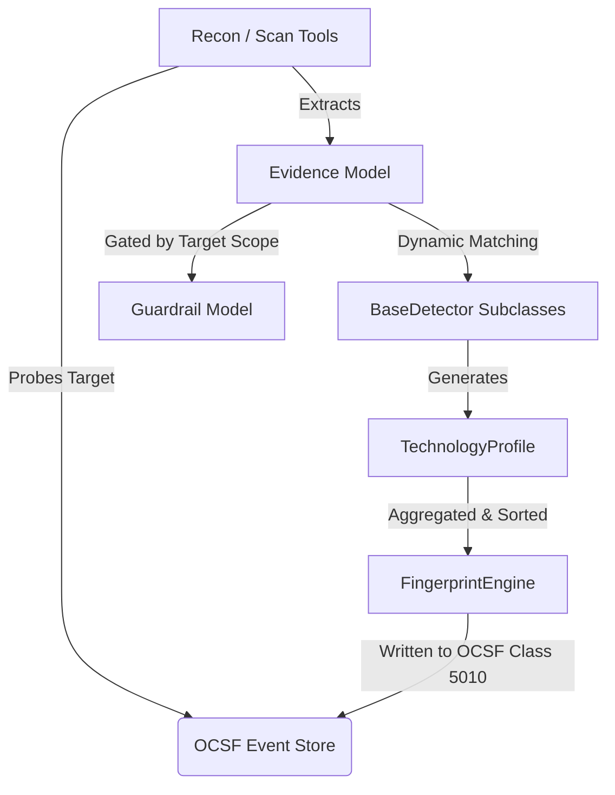

# Scope Justification: Technology Intelligence & Fingerprinting

This document details the architectural justification, security scope, and data model mapping for the Fingerprint Engine and the Technology Intelligence Agent within the Cadresec ecosystem.

---

## 1. Scope Justification: Why Technology Fingerprinting is in Scope

In autonomous security assessments, blind vulnerability scanning is noisy, inefficient, and presents high operational risk (e.g., executing Linux payloads against IIS servers can trigger alerts or crash legacy services). To perform high-fidelity red teaming, Cadresec requires a **contextual map** of the target environment:

1. **Precision Vulnerability Analysis**: Knowing the exact technologies (e.g., Apache 2.4.41 vs. Nginx 1.25.1) allows downstream agents (such as `vuln_analysis`) to focus their search space when querying public vulnerability datasets, drastically reducing scanning noise and false positives.
2. **Risk and RoE Mitigation**: Identifying specific middleware (such as IIS vs. Node.js) allows the framework to determine which passive or active-safe scanning tools to execute next, preventing incompatibilities that could disrupt target services and ensuring strict adherence to safety-first Rules of Engagement (ROE).
3. **Passive Recon Maximization**: Fingerprinting maximizes intelligence derived from safe, low-risk probes (like parsing HTTP headers or cookies) before escalating to active scanning.

---

## 2. Data Model Architecture & Relationships

Technology fingerprinting operates on two core data structures: [Evidence](file:///c:/Users/mujum/OneDrive/Desktop/Cadresec/cadresec/intelligence/evidence.py) and [TechnologyProfile](file:///c:/Users/mujum/OneDrive/Desktop/Cadresec/cadresec/intelligence/models.py). The diagram below illustrates how they relate to the underlying **OCSF Event Store** and **Guardrail Model**:

### 2.1 The Evidence Model
* **Definition**: A Pydantic model representing a single observable observation (e.g., `Server: nginx/1.25.1` or cookie name `PHPSESSID`).
* **Source**: Extracted dynamically from outputs of raw tools (`http_probe`, `nmap`, `dns_lookup`, `banner_grab`).
* **OCSF Mapping**: Evidence objects act as a lightweight, in-memory representation of raw telemetry fields captured in OCSF `NetworkActivity` (Class 4001) or `Discovery` (Class 5010) records.

### 2.2 The Technology Profile
* **Definition**: An aggregated, deduplicated representation of a detected technology, containing combined confidence scores (derived via the Noisy-OR logic) and supporting evidence strings.
* **OCSF Mapping**: Technology Profiles directly map to the **OCSF Discovery Event (Class 5010)**, specifically populating the `device.services` list and the `device.description` summary. When a profile is finalized by the Fingerprint Engine, it is logged to the session's OCSF audit database.

---

## 3. Guardrail Model Integration

The Technology Intelligence agent is fully bound by the session's Rules of Engagement (ROE) guardrails:

1. **Target Scope Gating**: Every tool that gathers evidence (like `HTTPProbe`) must supply its target to `ToolSpec.run()`, which executes `session.guardrails.assert_in_scope(target)`. Unscoped target evidence is blocked at the gate.
2. **Approval Verification**: Evidence collection risk is mitigated by classifying tools into tiers (e.g., `http_probe` is `ACTIVE_SAFE`). Tool specs must pass `assert_approved(tool_name, risk_tier)` prior to execution.
3. **Passive Fallback**: If an target is classified under a strict risk-tier that restricts active probes, the Fingerprint Engine can still process passive evidence (such as public DNS TXT records or DNS resolution responses) to extract technology profiles without ever interacting directly with the target host.
